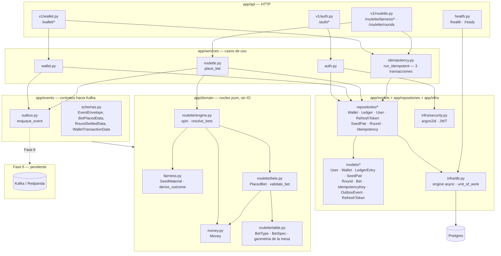
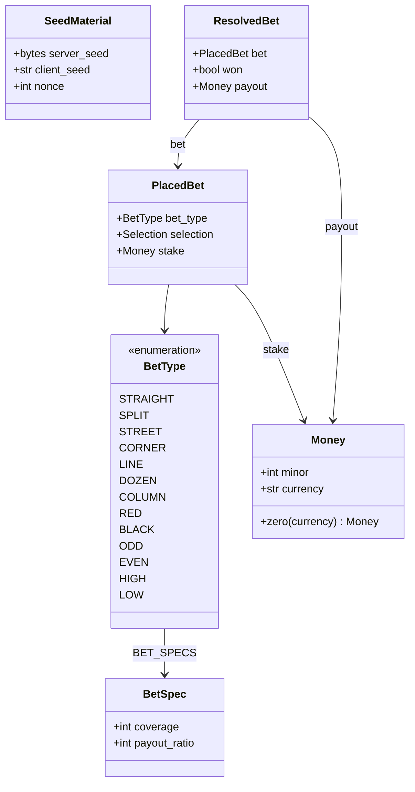
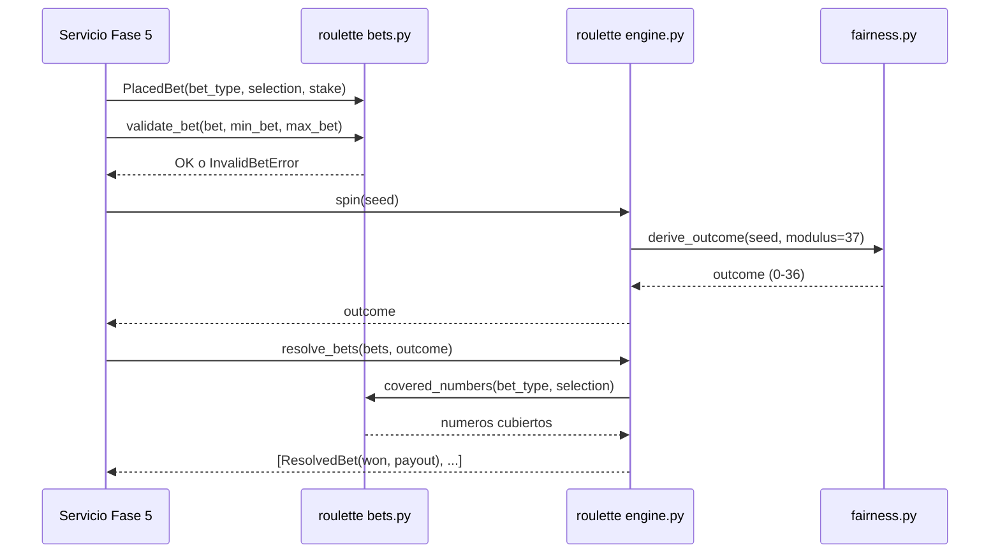
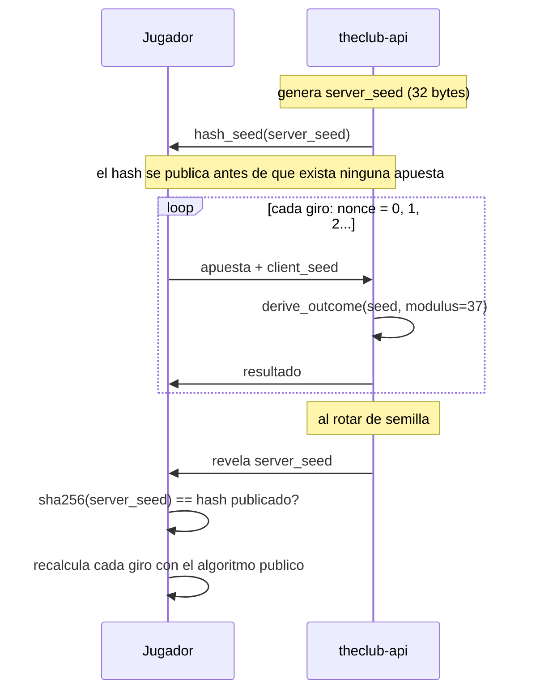
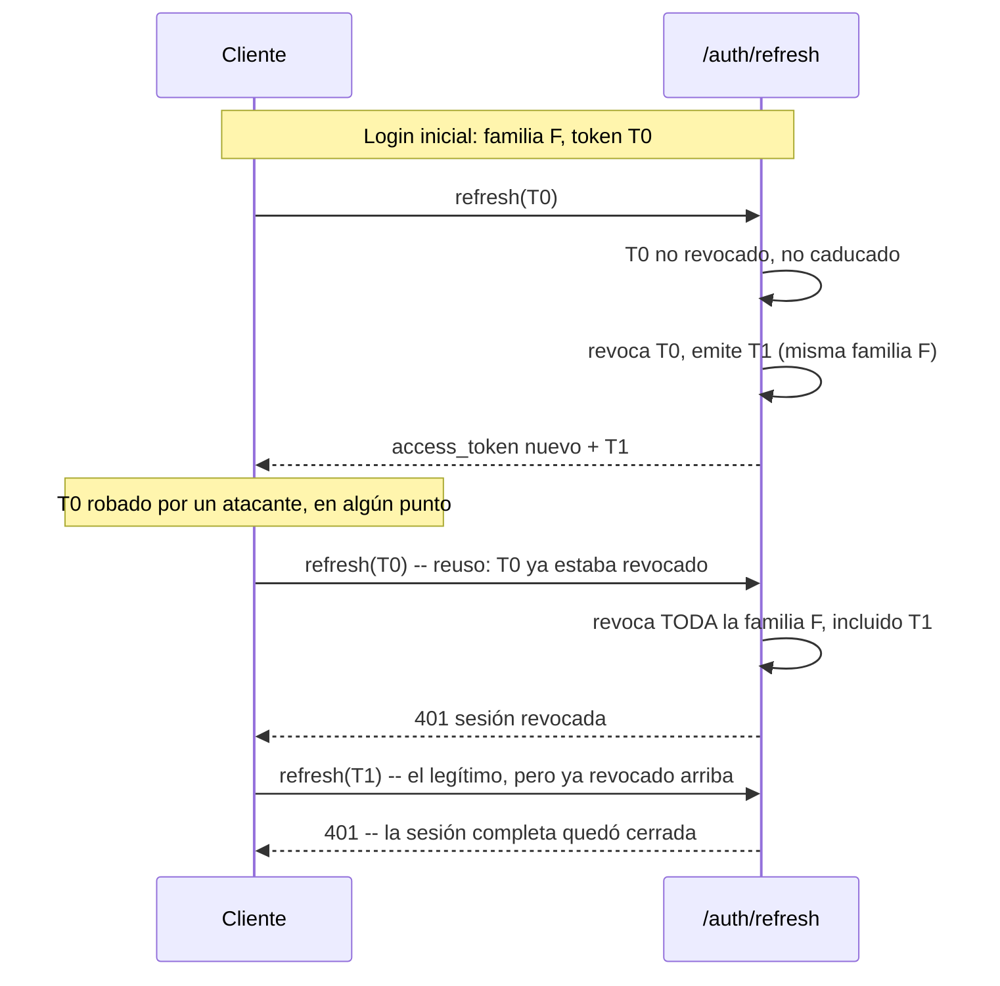
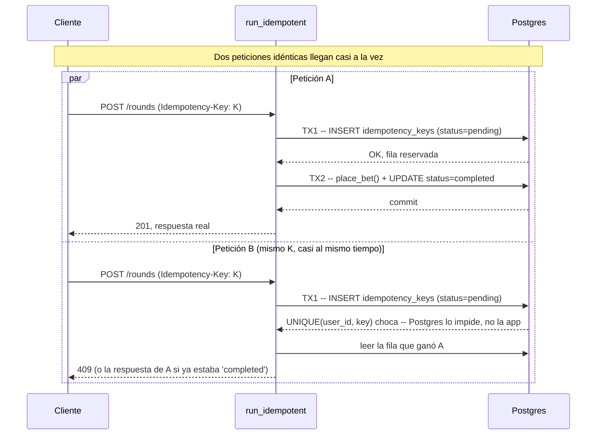

# theclub-api

Motor de juego de **The Club**: resuelve rondas de ruleta, gestiona balances y publica cada
evento a Kafka para que `theclub-data` lo procese.

El plan completo del proyecto está en [`plan/theclub-api-PLAN.md`](plan/theclub-api-PLAN.md). El
contrato de eventos y el borrador de API hacia `theclub-web`/`theclub-data` está en
[`contracts/`](contracts/).

## Requisitos

- [uv](https://docs.astral.sh/uv/) (gestiona también el intérprete de Python)
- Docker y Docker Compose

## Arranque

```bash
uv sync                 # crea .venv con Python 3.14 y las dependencias
cp .env.example .env    # opcional: en local todo tiene defaults
make up                 # postgres + redpanda + console + api
```

Comprobación rápida:

```bash
curl localhost:8010/health   # {"status":"ok",...}
curl localhost:8010/ready    # {"status":"ready","checks":{"database":"ok"}}
```

| Servicio | URL | Variable para cambiar el puerto |
|---|---|---|
| API | http://localhost:8010 | `API_PORT` |
| Documentación interactiva | http://localhost:8010/docs | — |
| Consola de Redpanda | http://localhost:8090 | `CONSOLE_PORT` |
| Postgres | `localhost:5432` (`theclub` / `theclub`) | `POSTGRES_PORT` |
| Kafka desde el host | `localhost:19092` | `KAFKA_PORT` |
| Kafka dentro de compose | `redpanda:9092` | — |

Los puertos publicados en el host se eligieron para no chocar con los 8000/8080 que
suelen ocupar otros proyectos. Si alguno te estorba, cámbialo en tu `.env`.

Para desarrollar con recarga automática sin reconstruir la imagen:

```bash
make dev
```

## Comandos

```bash
make test        # todos los tests
make test-unit   # solo los que no necesitan servicios levantados
make lint        # ruff (lint + formato)
make typecheck   # mypy en modo estricto
make check       # lo mismo que exige el CI
make reset       # tira los servicios y BORRA los volúmenes

make db-upgrade   # aplica las migraciones pendientes
make db-downgrade # revierte la última migración
make db-revision m="mensaje"  # autogenera una migración a partir de los modelos
```

## Endpoints

- `GET /health` — *liveness*. No consulta ninguna dependencia; si responde, el proceso vive.
- `GET /ready` — *readiness*. Ejecuta los checks registrados y devuelve `503` si alguno falla.
  Desde la Fase 3 registra `database` (un `SELECT 1` contra Postgres); la Fase 6 añadirá `kafka`.
- `POST /api/v1/auth/register` — email + password → crea `User` + `Wallet` en cero + el primer
  `SeedPair` activo, devuelve tokens.
- `POST /api/v1/auth/login` — email + password → tokens.
- `POST /api/v1/auth/refresh` — rota el refresh token (ver más abajo).
- `GET /api/v1/auth/me` — requiere `Authorization: Bearer <access_token>`.
- `POST /api/v1/auth/logout` — revoca la familia del refresh token del cuerpo. Idempotente
  (repetirlo, o mandar un token ajeno o inexistente, nunca es un error — `204` igual).
- `GET /api/v1/roulette/fairness/current` — hash del seed activo + client_seed.
- `POST /api/v1/roulette/fairness/rotate` — revela el seed anterior, activa uno nuevo.
- `POST /api/v1/roulette/rounds` — coloca una o más apuestas y resuelve la ronda en la misma
  petición. `Idempotency-Key` obligatorio.
- `GET /api/v1/roulette/rounds` — historial, paginado por cursor.
- `GET /api/v1/wallet/balance` — `{balance_minor, currency}`.
- `GET /api/v1/wallet/transactions` — el ledger, paginado por cursor.
- `POST /api/v1/wallet/deposit` — depósito simulado. `Idempotency-Key` obligatorio también.

`/auth/register` y `/auth/login` están limitados a 5 peticiones/minuto por IP;
`/auth/refresh` a 10/minuto.

## Arquitectura

`app/domain/` es el único paquete que no depende de nada externo (sin FastAPI, sin
SQLAlchemy, sin IO) — es matemática pura sobre dinero, fairness y ruleta. Todo lo demás
depende de él, nunca al revés:



Las líneas punteadas son integraciones que todavía no existen (se activan en la fase
indicada); las sólidas ya están escritas y probadas.

### El dominio de la ruleta



`payout = stake * (payout_ratio + 1)` si gana — el `+1` es la devolución del propio
stake, que se debita por adelantado para toda apuesta (gane o pierda). Para las 13
apuestas se cumple `coverage * (payout_ratio + 1) == 36`: es la forma matemática de que
la ventaja de la casa (2.70%) sea idéntica sin importar qué se apueste.

### Cómo se resuelve un giro



### Provably fair — commit-reveal



### Persistencia

- **Sin columna de bloqueo optimista en `wallets`.** El plan original la incluía, pero
  `debit`/`credit` son una sola sentencia `UPDATE ... WHERE ... RETURNING` — sin lectura
  previa, sin carrera que un `version` deba prevenir. El repositorio no expone (ni
  expondrá) un `set_balance`, que es lo único que sí necesitaría uno.
- **`status`/`kind` como `String` + `CHECK`, no `ENUM` nativo de Postgres** — añadir un
  valor nuevo es una migración normal, no un `ALTER TYPE` con las restricciones
  históricas de Postgres para tipos enumerados.
- **Convención de nombres en `models/base.py`** para que `alembic revision --autogenerate`
  reconozca constraints entre entornos en vez de generarles nombres aleatorios.
- **Índice único parcial en `seed_pairs`** (`WHERE status = 'active'`): la base de datos
  garantiza sola que un usuario nunca tenga dos semillas activas a la vez.
- **Índice parcial en `outbox`** (`WHERE published_at IS NULL`): la consulta del relay
  (Fase 6) sigue siendo barata aunque la tabla acumule millones de filas ya publicadas.

### Autenticación

- **El refresh token es un string opaco (`secrets.token_urlsafe`), no un JWT.** Como de
  todas formas hay que consultar la base en cada refresh para saber si está revocado, un
  JWT no aporta nada — y sí puede filtrar metadata en su payload. Solo se guarda su hash
  SHA-256 (no argon2id: eso es caro a propósito para resistir fuerza bruta sobre secretos
  de baja entropía como una contraseña; un token aleatorio de 256 bits no la necesita).
- **Mismo error para "el email no existe" y "la contraseña es incorrecta"** en login —
  distinguirlos permitiría usar el endpoint para averiguar qué emails están registrados.
- **`get_current_user` recarga el usuario desde la base en cada petición** en vez de
  confiar solo en el `sub` del JWT — así una cuenta suspendida deja de poder usar su
  access token antes de que caduque, no solo en el siguiente login.



### El caso de uso de apostar

`POST /roulette/rounds` y `POST /wallet/deposit` comparten el mismo mecanismo de
idempotencia (`app/services/idempotency.py`), pensado para que **dos peticiones
verdaderamente simultáneas** con la misma `Idempotency-Key` — no solo un reintento
secuencial — nunca ejecuten el negocio dos veces. Son tres transacciones
independientes, no una:



Si `place_bet()` falla (fondos insuficientes, etc.), TX2 completa se revierte —
pero la fila `pending` de TX1 ya estaba comprometida aparte y queda huérfana. Una
tercera transacción la borra antes de devolver el error, para que un reintento
posterior con la misma clave no se quede viendo un "en curso" que ya no lo está.
Y si el proceso que reservó la clave muere a media ejecución (nunca llega ni a
completar ni a fallar limpiamente), la fila `pending` no bloquea para siempre:
pasados 30 segundos se considera abandonada y se reclama.

Verificado con un test que lanza 10 peticiones *de verdad* concurrentes
(`asyncio.gather`, no un bucle secuencial) contra el mismo endpoint con la misma
clave, y comprueba en la base de datos que se creó exactamente una ronda y se
debitó el stake exactamente una vez.

### Auditoría honesta antes de la Fase 6

Antes de seguir a Kafka, se pidió una auditoría explícita de huecos — no
sobreingeniería, pero sí que lo que existe esté bien hecho. Lo que salió y se
corrigió, todo con su test:

- **Sin rate limiting en `/rounds` ni `/deposit`** — estaba solo en `/auth/*`,
  y son justo los dos endpoints que mueven dinero de verdad. Ahora 30/minuto
  en ambos.
- **Sin `statement_timeout` en el motor de Postgres** — una consulta colgada
  dejaba el request esperando para siempre. Ahora Postgres cancela sola
  cualquier sentencia que tarde más de 30s (`connect_args`, vía `-c
  statement_timeout`).
- **`Idempotency-Key` sin tope de tamaño** y **`amount_minor` del depósito sin
  tope superior** — ambos con validación explícita ahora (200 caracteres y
  10.000.000 respectivamente).
- **`assert` para invariantes de negocio** ("todo usuario tiene wallet",
  "todo usuario tiene un seed pair activo") en vez de una excepción real —
  `assert` desaparece si el intérprete corre con `-O`/`PYTHONOPTIMIZE`, así
  que un invariante de negocio no debería depender de eso. Ahora es
  `DataIntegrityError`, mapeada a 500 y registrada en el log — con tests que
  la fuerzan tanto a nivel de servicio como a través del endpoint HTTP real.
- **Ningún test validaba un evento *real* del outbox contra el JSON Schema**
  de la Fase 1 — solo ejemplos estáticos. Ahora un test coloca una apuesta de
  verdad, lee las filas que quedaron en `outbox`, y las valida contra
  `contracts/events/`.
- **`_enqueue_round_events()` recibía 18 parámetros sueltos** — señal de que
  debía ser un objeto, no una lista de argumentos. Ahora es un solo
  `_RoundContext` (dataclass), y de paso `place_bet`/`deposit`/`fairness`
  devuelven resultados tipados (`PlaceBetResult`, `BalanceView`, etc.) en vez
  de `dict[str, Any]` construido a mano — un typo en una clave ahora lo pilla
  mypy en la construcción del dataclass, no un test en producción.

Lo que se dejó tal cual, a propósito: el tamaño del pool de conexiones (los
valores por defecto de SQLAlchemy — `max_overflow=10`, `pool_timeout=30` —
ya dan margen razonable sin que hiciera falta tocar nada) y el crecimiento
sin límite de la tabla `outbox` (es exactamente lo que la Fase 6 resuelve;
construir un mecanismo de limpieza antes de tener el relay real sería
adelantar trabajo sin saber todavía cómo lo va a consumir).

Una segunda pasada encontró un hueco funcional real, no solo de robustez:
**no existía forma de cerrar sesión.** `RefreshTokenRepository.revoke_family`
ya existía (lo usa la detección de reuso desde la Fase 4), pero ningún
endpoint lo exponía para que un usuario terminara su propia sesión a
voluntad — un refresh token vivía hasta su TTL natural (14 días) pasara lo
que pasara. Ahora `POST /auth/logout` lo hace: revoca la familia completa
(no solo el token que se mandó, toda la cadena de rotaciones de esa sesión),
es idempotente a propósito (repetirlo, o mandar un token ajeno o
inexistente, nunca es un error — así no revela si un token pertenece a
otra cuenta), y compara `stored.user_id` contra el usuario autenticado para
que nadie pueda cerrarle la sesión a otro pasando su refresh token en el
cuerpo.

## Calidad y testing

### Metodología

No es TDD estricto (rojo-verde-refactor). El flujo real es: diseño en prosa primero
(estructura de archivos, firmas, decisiones — sin código), luego implementación y tests
juntos en el mismo paso, con revisión antes de cada commit. La disciplina que aporta el
TDD clásico —decidir la interfaz desde el punto de vista de quien la usa, antes de saber
cómo se implementa— la cubre aquí la fase de diseño explícito en vez del test que falla
primero.

### Clean code — con matices, no como eslogan

A favor: `app/domain/` es honestamente puro (nada de IO, comprobado por el hecho de que
1M de giros simulados corren en ~4s sin Docker); funciones cortas; nombres que no
necesitan comentario al lado; los 13 tipos de apuesta viven en un solo sitio
(`table.py`) y todo lo demás los reutiliza en vez de duplicarlos.

Compromisos conocidos, no maquillados: `covered_numbers()` en `bets.py` es la función
más densa del proyecto (tres formas de validar selección en una sola función); los
tests de dominio importan símbolos privados (`_FIXED_SELECTIONS` y similares) del
módulo que prueban, que es whitebox testing aceptado pero no "clean" en sentido
estricto; y `test_roulette_engine.py` reutiliza un generador de datos definido en
`test_roulette_bets.py` en vez de vivir en un módulo de fixtures separado.

Una trampa real que encontramos en la Fase 3, documentada para que no se repita: Python
3.14 difiere la evaluación de anotaciones (PEP 649), así que `ruff --fix` propone quitar
las comillas de forward-refs como `Mapped["Wallet"]`. Es **seguro** cuando las dos clases
viven en el mismo archivo (`Round`/`Bet` en `round.py`) porque para cuando SQLAlchemy
configura los mappers, el módulo ya terminó de cargar y el nombre existe. Es **un
`NameError` en tiempo de configuración de mappers** cuando la clase referenciada solo se
importa bajo `TYPE_CHECKING` en otro módulo (`User`/`Wallet` entre sí) — lo comprobamos
con un script aislado antes de decidir qué líneas llevan `# noqa: UP037` a propósito.

### Migraciones excluidas del lint

`alembic/versions/` está fuera de `ruff` (`extend-exclude`) y fuera de `mypy` (no incluido
en `files`). Alembic las genera con su propio estilo (`Union[...]`, comillas simples) y
reescribirlas a mano cada vez que se regeneran no aporta nada — `alembic/env.py`, que sí
escribimos a mano, sigue linteado normalmente.

### Bugs reales encontrados durante el desarrollo

No es una lista de virtudes — son cuatro errores que el propio proceso de escribir tests y
razonar el diseño encontró antes de que llegaran a ningún sitio importante:

| Fase | Qué estaba mal | Cómo se encontró |
|---|---|---|
| 1 | `payout_minor` no devolvía el stake apostado — un 35:1 pagaba 34x en vez de 35x | Al diseñar la Fase 2 y derivar la fórmula desde cero |
| 3 | Las columnas de fecha eran `TIMESTAMP` sin zona horaria, contra lo que el propio plan decía ("todos los timestamps en TIMESTAMPTZ UTC") | Al necesitar comparar `datetime.now(UTC)` con `expires_at` en la Fase 4 |
| 4 | Revocar la familia entera de refresh tokens al detectar un reuso no sobrevivía: el rollback automático de la transacción deshacía la revocación justo antes de guardarla | Un test de integración que reintentaba el token ya rotado tras el "robo" |
| 5 | Al reclamar una fila `idempotency_keys` abandonada, un `session.begin()` chocaba contra la transacción que SQLAlchemy ya había auto-iniciado con el `SELECT` anterior — habría sido un 500 permanente la primera vez que un proceso muriera a medio camino | Un test que simula esa fila abandonada a mano y comprueba que el reclamo de verdad ejecuta el negocio |

Ninguno lo encontró una revisión manual — los cuatro salieron de escribir el siguiente
test o la siguiente fase y darse cuenta de que algo no cuadraba.

### Cobertura

```
TOTAL   1215 stmts   8 miss   128 branch   7 partial   99% cover
```

Sin umbral mínimo en CI todavía (`pytest-cov` está configurado; el `--cov-fail-under`
se decide en la Fase 9). Los huecos que quedan están identificados, no son descuido:

| Dónde | Qué falta cubrir | Por qué |
|---|---|---|
| `app/domain/fairness.py` | La rama de rejection sampling que pide un HMAC extra | Probabilidad ~10⁻⁹ de que ocurra; forzarla exigiría mockear `hmac` para un caso de valor dudoso |
| `app/api/health.py` | El timeout de un readiness check | Necesitaría un check que duerma de verdad; el camino de "check que falla" sí está cubierto |
| `app/services/idempotency.py` | Dos micro-carreras dentro de la propia carrera (dos reclamos simultáneos de la misma fila abandonada; el fallback final tras un segundo choque) | Exigiría inyectar temporización falsa para forzar un instante exacto; el mecanismo principal sí está probado bajo concurrencia real |
| `app/api/v1/roulette.py` | `DataIntegrityError` si un `Round` quedara sin `outcome` | Mismo patrón que ya se prueba seis veces para wallet/seed pair; se dejó sin un séptimo test casi idéntico por rendimiento decreciente, no por no haberlo pensado |

## Estado

Completadas: Fase 0 (fundación), Fase 1 (contratos de eventos), Fase 2 (dominio de
fairness y ruleta), Fase 3 (persistencia), Fase 4 (autenticación), Fase 5 (el caso de
uso de apostar). Siguiente: Fase 6 — Kafka de verdad (productor + relay del outbox).
