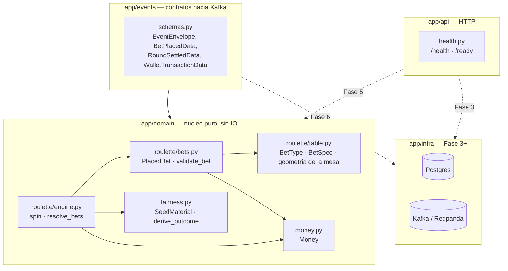
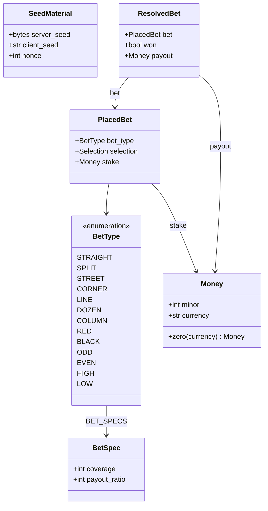
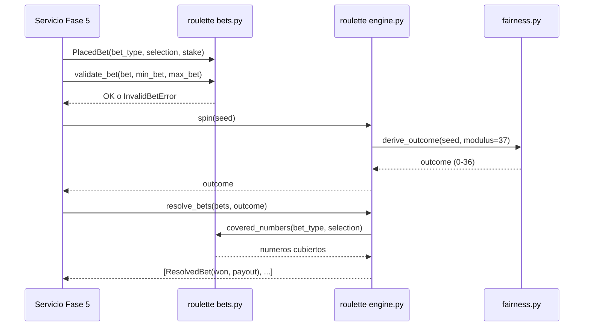
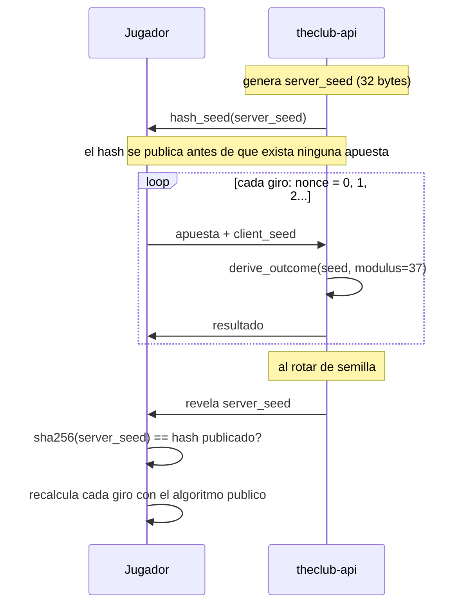

# theclub-api

Motor de juego de **The Club**: resuelve rondas de ruleta, gestiona balances y publica cada
evento a Kafka para que `theclub-data` lo procese.

El plan completo del proyecto está en [`plan/theclub-api-PLAN.md`](plan/theclub-api-PLAN.md). El
contrato de eventos y el borrador de API hacia `theclub-web`/`theclub-data` está en
[`contracts/`](contracts/).

## Requisitos

- [uv](https://docs.astral.sh/uv/) (gestiona también el intérprete de Python)
- Docker y Docker Compose

## Arranque

```bash
uv sync                 # crea .venv con Python 3.14 y las dependencias
cp .env.example .env    # opcional: en local todo tiene defaults
make up                 # postgres + redpanda + console + api
```

Comprobación rápida:

```bash
curl localhost:8010/health   # {"status":"ok",...}
curl localhost:8010/ready    # {"status":"ready","checks":{}}
```

| Servicio | URL | Variable para cambiar el puerto |
|---|---|---|
| API | http://localhost:8010 | `API_PORT` |
| Documentación interactiva | http://localhost:8010/docs | — |
| Consola de Redpanda | http://localhost:8090 | `CONSOLE_PORT` |
| Postgres | `localhost:5432` (`theclub` / `theclub`) | `POSTGRES_PORT` |
| Kafka desde el host | `localhost:19092` | `KAFKA_PORT` |
| Kafka dentro de compose | `redpanda:9092` | — |

Los puertos publicados en el host se eligieron para no chocar con los 8000/8080 que
suelen ocupar otros proyectos. Si alguno te estorba, cámbialo en tu `.env`.

Para desarrollar con recarga automática sin reconstruir la imagen:

```bash
make dev
```

## Comandos

```bash
make test        # todos los tests
make test-unit   # solo los que no necesitan servicios levantados
make lint        # ruff (lint + formato)
make typecheck   # mypy en modo estricto
make check       # lo mismo que exige el CI
make reset       # tira los servicios y BORRA los volúmenes
```

## Endpoints

- `GET /health` — *liveness*. No consulta ninguna dependencia; si responde, el proceso vive.
- `GET /ready` — *readiness*. Ejecuta los checks registrados y devuelve `503` si alguno falla.
  Hoy la lista está vacía: la Fase 3 registrará Postgres y la Fase 6, Kafka.

## Arquitectura

`app/domain/` es el único paquete que no depende de nada externo (sin FastAPI, sin
SQLAlchemy, sin IO) — es matemática pura sobre dinero, fairness y ruleta. Todo lo demás
depende de él, nunca al revés:



Las líneas punteadas son integraciones que todavía no existen (se activan en la fase
indicada); las sólidas ya están escritas y probadas.

### El dominio de la ruleta



`payout = stake * (payout_ratio + 1)` si gana — el `+1` es la devolución del propio
stake, que se debita por adelantado para toda apuesta (gane o pierda). Para las 13
apuestas se cumple `coverage * (payout_ratio + 1) == 36`: es la forma matemática de que
la ventaja de la casa (2.70%) sea idéntica sin importar qué se apueste.

### Cómo se resuelve un giro



### Provably fair — commit-reveal



## Calidad y testing

### Metodología

No es TDD estricto (rojo-verde-refactor). El flujo real es: diseño en prosa primero
(estructura de archivos, firmas, decisiones — sin código), luego implementación y tests
juntos en el mismo paso, con revisión antes de cada commit. La disciplina que aporta el
TDD clásico —decidir la interfaz desde el punto de vista de quien la usa, antes de saber
cómo se implementa— la cubre aquí la fase de diseño explícito en vez del test que falla
primero.

### Clean code — con matices, no como eslogan

A favor: `app/domain/` es honestamente puro (nada de IO, comprobado por el hecho de que
1M de giros simulados corren en ~4s sin Docker); funciones cortas; nombres que no
necesitan comentario al lado; los 13 tipos de apuesta viven en un solo sitio
(`table.py`) y todo lo demás los reutiliza en vez de duplicarlos.

Compromisos conocidos, no maquillados: `covered_numbers()` en `bets.py` es la función
más densa del proyecto (tres formas de validar selección en una sola función); los
tests de dominio importan símbolos privados (`_FIXED_SELECTIONS` y similares) del
módulo que prueban, que es whitebox testing aceptado pero no "clean" en sentido
estricto; y `test_roulette_engine.py` reutiliza un generador de datos definido en
`test_roulette_bets.py` en vez de vivir en un módulo de fixtures separado.

### Cobertura

```
TOTAL   346 stmts   9 miss   56 branch   4 partial   97% cover
```

Sin umbral mínimo en CI todavía (`pytest-cov` está configurado; el `--cov-fail-under`
se decide en la Fase 9). Los huecos que sí existen están identificados, no son
descuido:

| Dónde | Qué falta cubrir | Por qué |
|---|---|---|
| `app/domain/fairness.py` | La rama de rejection sampling que pide un HMAC extra | Probabilidad ~10⁻⁹ de que ocurra; forzarla exigiría mockear `hmac` para un caso de valor dudoso |
| `app/api/health.py` | El timeout de un readiness check | Necesitaría un check que duerma de verdad; el camino de "check que falla" sí está cubierto |
| `app/main.py` | El cuerpo del `lifespan` | `ASGITransport` no dispara el lifespan de FastAPI en los tests; se cierra en la Fase 3, cuando el lifespan abra el engine de Postgres y haga falta `asgi-lifespan` de todas formas |

## Estado

Completadas: Fase 0 (fundación), Fase 1 (contratos de eventos), Fase 2 (dominio de
fairness y ruleta). Siguiente: Fase 3 — persistencia (modelos SQLAlchemy, migración
Alembic, invariante ledger↔balance).
