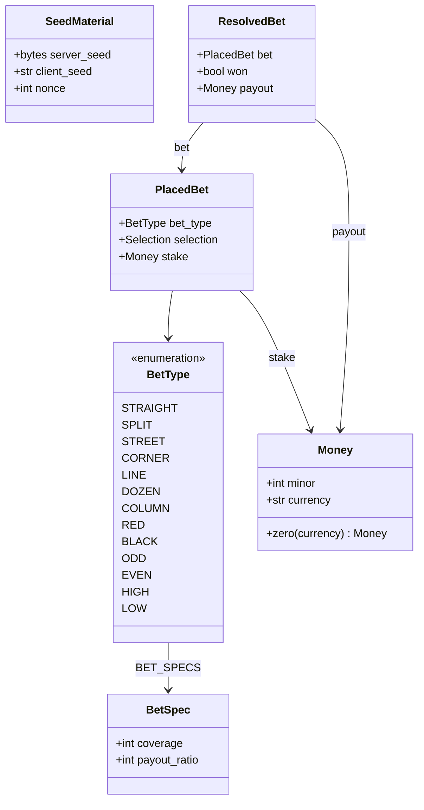
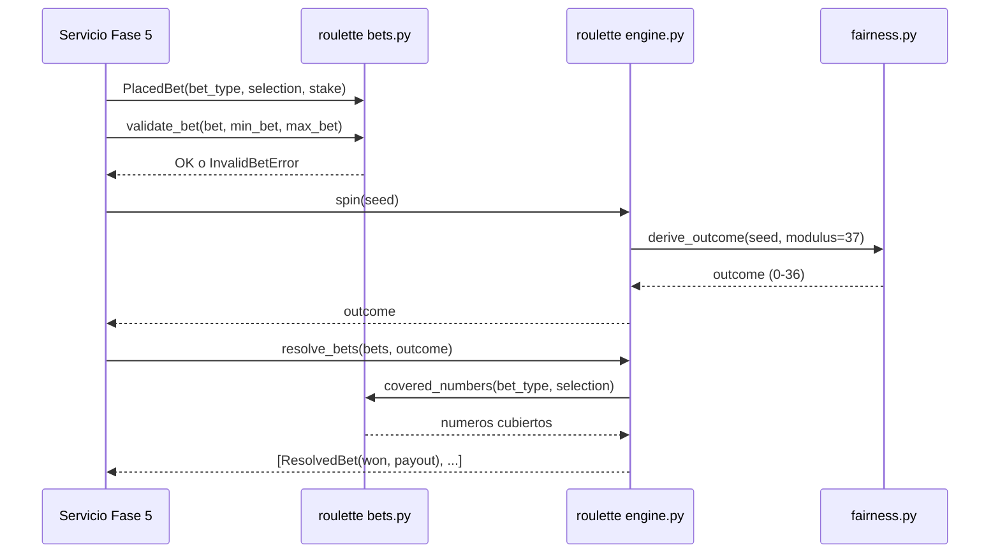
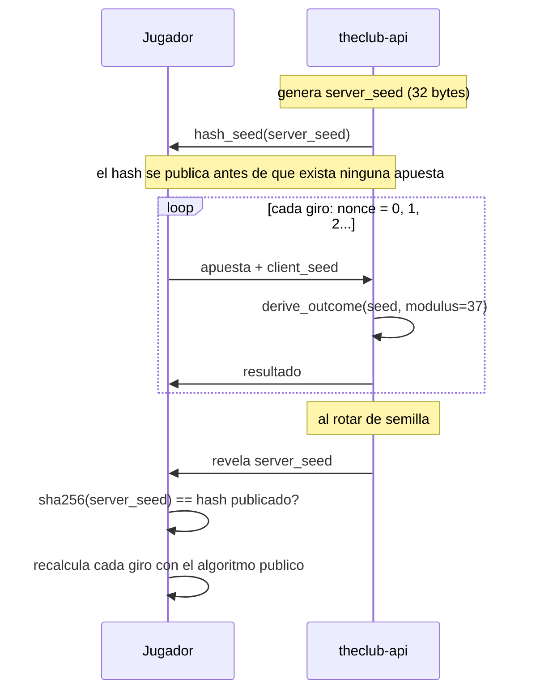
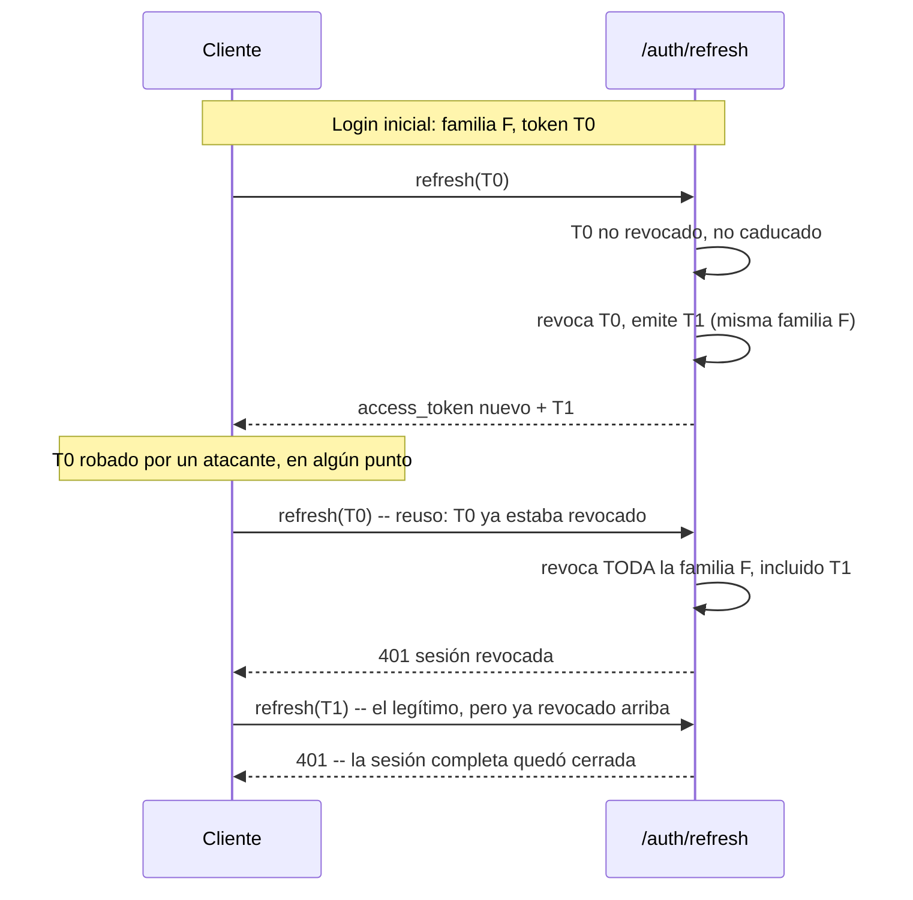
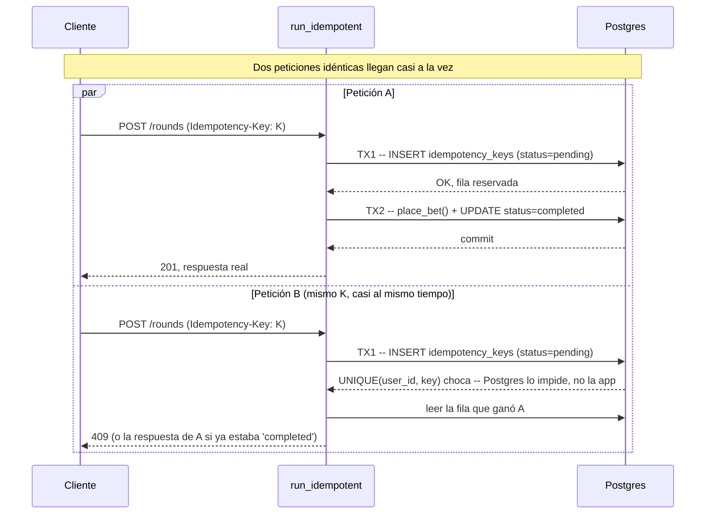
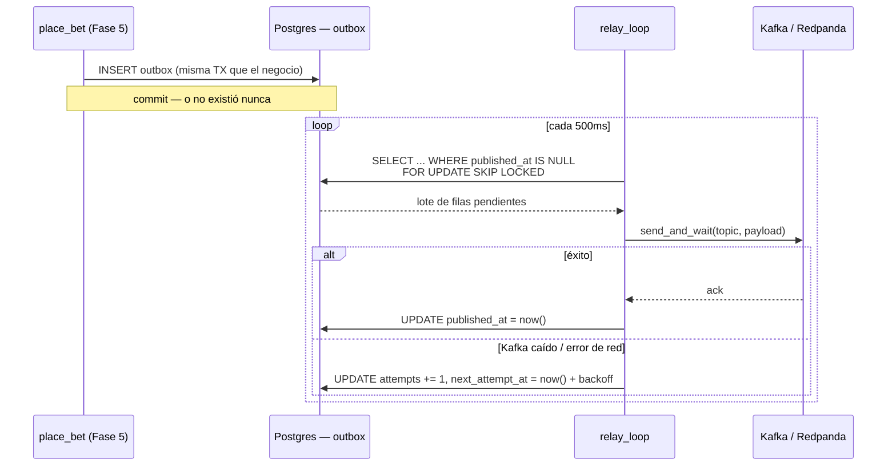
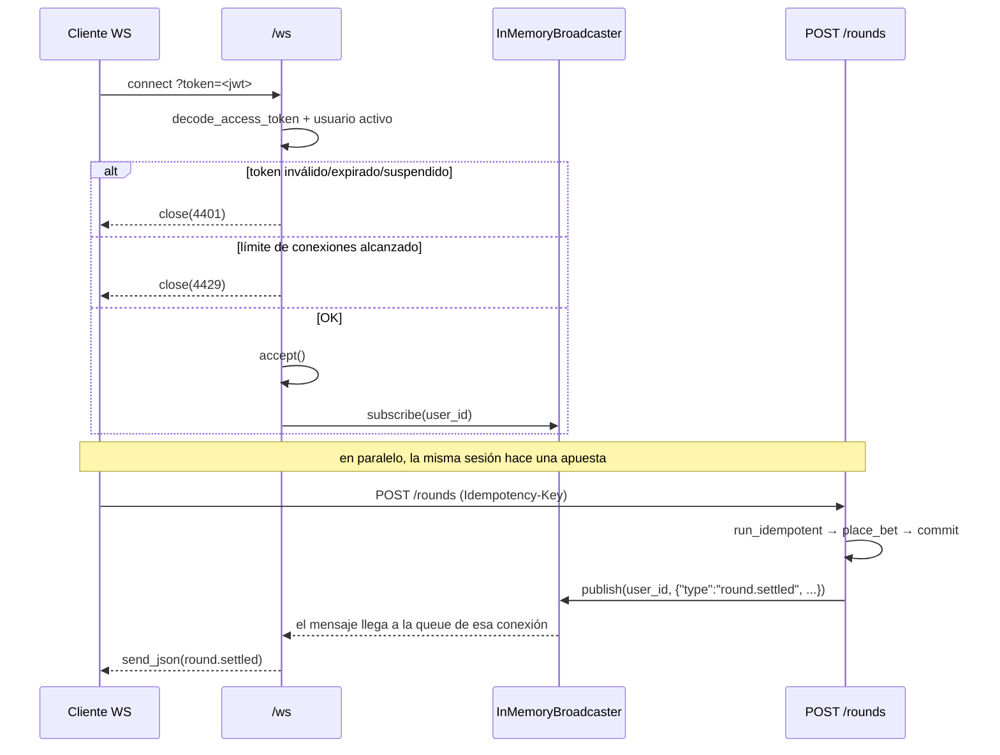
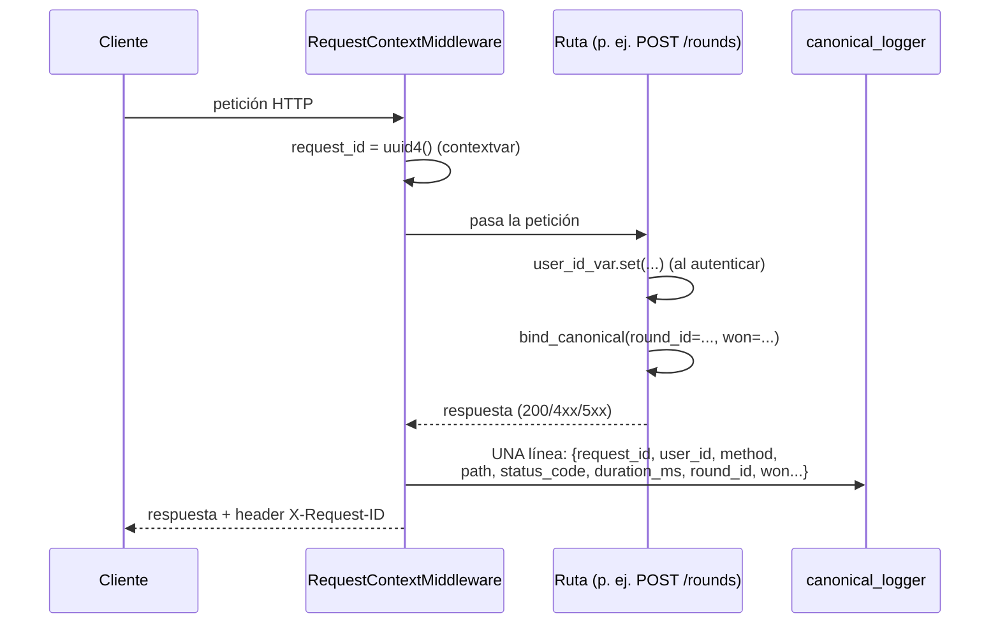

# theclub-api

Motor de juego de **The Club**: resuelve rondas de ruleta, gestiona balances y publica cada
evento a Kafka para que `theclub-data` lo procese.

El plan completo del proyecto está en [`plan/theclub-api-PLAN.md`](plan/theclub-api-PLAN.md). El
contrato de eventos y el borrador de API hacia `theclub-web`/`theclub-data` está en
[`contracts/`](contracts/).

## Requisitos

- [uv](https://docs.astral.sh/uv/) (gestiona también el intérprete de Python)
- Docker y Docker Compose

## Arranque

```bash
uv sync                 # crea .venv con Python 3.14 y las dependencias
cp .env.example .env    # opcional: en local todo tiene defaults
make up                 # postgres + redpanda + console + api
```

Comprobación rápida:

```bash
curl localhost:8010/health   # {"status":"ok",...}
curl localhost:8010/ready    # {"status":"ready","checks":{"database":"ok"}}
```

| Servicio | URL | Variable para cambiar el puerto |
|---|---|---|
| API | http://localhost:8010 | `API_PORT` |
| Documentación interactiva | http://localhost:8010/docs | — |
| Consola de Redpanda | http://localhost:8090 | `CONSOLE_PORT` |
| Postgres | `localhost:5432` (`theclub` / `theclub`) | `POSTGRES_PORT` |
| Kafka desde el host | `localhost:19092` | `KAFKA_PORT` |
| Kafka dentro de compose | `redpanda:9092` | — |

Los puertos publicados en el host se eligieron para no chocar con los 8000/8080 que
suelen ocupar otros proyectos. Si alguno te estorba, cámbialo en tu `.env`.

Para desarrollar con recarga automática sin reconstruir la imagen:

```bash
make dev
```

## Comandos

```bash
make test        # todos los tests
make test-unit   # solo los que no necesitan servicios levantados
make lint        # ruff (lint + formato)
make typecheck   # mypy en modo estricto
make check       # lo mismo que exige el CI
make reset       # tira los servicios y BORRA los volúmenes

make db-upgrade   # aplica las migraciones pendientes
make db-downgrade # revierte la última migración
make db-revision m="mensaje"  # autogenera una migración a partir de los modelos
```

## Endpoints

- `GET /health` — *liveness*. No consulta ninguna dependencia; si responde, el proceso vive.
- `GET /ready` — *readiness*. Ejecuta los checks registrados y devuelve `503` si alguno falla.
  Registra `database` (un `SELECT 1` contra Postgres, desde la Fase 3) y, desde la Fase 6,
  `kafka` (pide los metadatos de un topic real al productor).
- `POST /api/v1/auth/register` — email + password → crea `User` + `Wallet` en cero + el primer
  `SeedPair` activo, devuelve tokens.
- `POST /api/v1/auth/login` — email + password → tokens.
- `POST /api/v1/auth/refresh` — rota el refresh token (ver más abajo).
- `GET /api/v1/auth/me` — requiere `Authorization: Bearer <access_token>`.
- `POST /api/v1/auth/logout` — revoca la familia del refresh token del cuerpo. Idempotente
  (repetirlo, o mandar un token ajeno o inexistente, nunca es un error — `204` igual).
- `GET /api/v1/roulette/fairness/current` — hash del seed activo + client_seed.
- `POST /api/v1/roulette/fairness/rotate` — revela el seed anterior, activa uno nuevo.
- `POST /api/v1/roulette/rounds` — coloca una o más apuestas y resuelve la ronda en la misma
  petición. `Idempotency-Key` obligatorio.
- `GET /api/v1/roulette/rounds` — historial, paginado por cursor.
- `GET /api/v1/wallet/balance` — `{balance_minor, currency}`.
- `GET /api/v1/wallet/transactions` — el ledger, paginado por cursor.
- `POST /api/v1/wallet/deposit` — depósito simulado. `Idempotency-Key` obligatorio también.
- `GET /api/v1/ws?token=<access_token>` — WebSocket. Empuja `round.settled` y `balance.updated`
  al usuario dueño del token en cuanto su apuesta o depósito comprometen. Token inválido, ausente
  o de un usuario suspendido → cierre `4401`; límite de conexiones o de intentos de conexión
  alcanzado → cierre `4429`.
- `GET /metrics` — métricas en formato Prometheus. Sin autenticación a propósito (ver la sección
  de endurecimiento) — se restringe a nivel de red en un despliegue real, no con un token.

`/auth/register` y `/auth/login` están limitados a 5 peticiones/minuto por IP;
`/auth/refresh` a 10/minuto; el resto de los endpoints HTTP, a 200/minuto por IP por defecto
(desde la Fase 8 — antes no tenían ningún límite).

## Arquitectura

`app/domain/` es el único paquete que no depende de nada externo (sin FastAPI, sin
SQLAlchemy, sin IO) — es matemática pura sobre dinero, fairness y ruleta. Todo lo demás
depende de él, nunca al revés:

```mermaid
flowchart TB
    subgraph API["app/api — HTTP"]
        health["health.py<br/>/health · /ready"]
        authapi["v1/auth.py<br/>/auth/*"]
        rouletteapi["v1/roulette.py<br/>/roulette/fairness/* · /roulette/rounds"]
        walletapi["v1/wallet.py<br/>/wallet/*"]
        wsapi["v1/ws.py<br/>/ws"]
    end

    subgraph WS["app/ws — notificaciones en vivo"]
        broadcaster["broadcaster.py<br/>Broadcaster · InMemoryBroadcaster"]
        connections["connections.py<br/>ConnectionRegistry"]
    end

    subgraph SERVICES["app/services — casos de uso"]
        authsvc["auth.py"]
        roulettesvc["roulette.py<br/>place_bet"]
        walletsvc["wallet.py"]
        idempotencysvc["idempotency.py<br/>run_idempotent — 3 transacciones"]
    end

    subgraph EVENTS["app/events — contratos hacia Kafka"]
        schemas["schemas.py<br/>EventEnvelope, BetPlacedData,<br/>RoundSettledData, WalletTransactionData"]
        outbox["outbox.py<br/>enqueue_event"]
        relay["relay.py<br/>relay_loop — tarea de fondo"]
        cleanup["outbox_cleanup.py<br/>purge_loop — tarea de fondo"]
    end

    subgraph DOMAIN["app/domain — nucleo puro, sin IO"]
        money["money.py<br/>Money"]
        fairness["fairness.py<br/>SeedMaterial · derive_outcome"]
        table["roulette/table.py<br/>BetType · BetSpec · geometria de la mesa"]
        bets["roulette/bets.py<br/>PlacedBet · validate_bet"]
        engine["roulette/engine.py<br/>spin · resolve_bets"]
    end

    subgraph PERSISTENCE["app/models + app/repositories + app/infra"]
        models["models/*<br/>User · Wallet · LedgerEntry · SeedPair<br/>Round · Bet · IdempotencyKey · OutboxEvent · RefreshToken"]
        repos["repositories/*<br/>Wallet · Ledger · User · RefreshToken<br/>SeedPair · Round · Idempotency"]
        db_infra["infra/db.py<br/>engine async · unit_of_work"]
        security["infra/security.py<br/>argon2id · JWT"]
        kafka_infra["infra/kafka.py<br/>create_producer · check_kafka"]
    end

    subgraph KAFKA["Kafka / Redpanda"]
        kafka[("topics .v1<br/>bets.placed · rounds.settled<br/>wallet.transactions")]
    end

    postgres[("Postgres")]

    EVENTS --> DOMAIN
    authapi --> authsvc
    rouletteapi --> idempotencysvc
    rouletteapi --> roulettesvc
    walletapi --> idempotencysvc
    walletapi --> walletsvc
    rouletteapi --> broadcaster
    walletapi --> broadcaster
    wsapi --> broadcaster
    wsapi --> connections
    idempotencysvc --> repos
    roulettesvc --> engine
    roulettesvc --> repos
    roulettesvc --> outbox
    walletsvc --> repos
    walletsvc --> outbox
    authsvc --> repos
    authsvc --> security
    health --> db_infra
    health --> kafka_infra
    outbox --> models
    relay --> models
    relay --> kafka_infra
    cleanup --> models
    kafka_infra --> kafka

    repos --> models
    repos --> db_infra
    db_infra --> postgres

    bets --> table
    bets --> money
    engine --> bets
    engine --> fairness
    engine --> money
```



Todo el diagrama son integraciones ya escritas y probadas — la última pieza en llegar
fue `relay.py`/`infra/kafka.py` en la Fase 6, cerrando el camino hacia Kafka que hasta
entonces terminaba en la tabla `outbox`.

### El dominio de la ruleta



`payout = stake * (payout_ratio + 1)` si gana — el `+1` es la devolución del propio
stake, que se debita por adelantado para toda apuesta (gane o pierda). Para las 13
apuestas se cumple `coverage * (payout_ratio + 1) == 36`: es la forma matemática de que
la ventaja de la casa (2.70%) sea idéntica sin importar qué se apueste.

### Cómo se resuelve un giro



### Provably fair — commit-reveal



### Persistencia

- **Sin columna de bloqueo optimista en `wallets`.** El plan original la incluía, pero
  `debit`/`credit` son una sola sentencia `UPDATE ... WHERE ... RETURNING` — sin lectura
  previa, sin carrera que un `version` deba prevenir. El repositorio no expone (ni
  expondrá) un `set_balance`, que es lo único que sí necesitaría uno.
- **`status`/`kind` como `String` + `CHECK`, no `ENUM` nativo de Postgres** — añadir un
  valor nuevo es una migración normal, no un `ALTER TYPE` con las restricciones
  históricas de Postgres para tipos enumerados.
- **Convención de nombres en `models/base.py`** para que `alembic revision --autogenerate`
  reconozca constraints entre entornos en vez de generarles nombres aleatorios.
- **Índice único parcial en `seed_pairs`** (`WHERE status = 'active'`): la base de datos
  garantiza sola que un usuario nunca tenga dos semillas activas a la vez.
- **Índice parcial en `outbox`** (`WHERE published_at IS NULL`): la consulta del relay
  (Fase 6) sigue siendo barata aunque la tabla acumule millones de filas ya publicadas.

### Autenticación

- **El refresh token es un string opaco (`secrets.token_urlsafe`), no un JWT.** Como de
  todas formas hay que consultar la base en cada refresh para saber si está revocado, un
  JWT no aporta nada — y sí puede filtrar metadata en su payload. Solo se guarda su hash
  SHA-256 (no argon2id: eso es caro a propósito para resistir fuerza bruta sobre secretos
  de baja entropía como una contraseña; un token aleatorio de 256 bits no la necesita).
- **Mismo error para "el email no existe" y "la contraseña es incorrecta"** en login —
  distinguirlos permitiría usar el endpoint para averiguar qué emails están registrados.
- **`get_current_user` recarga el usuario desde la base en cada petición** en vez de
  confiar solo en el `sub` del JWT — así una cuenta suspendida deja de poder usar su
  access token antes de que caduque, no solo en el siguiente login.



### El caso de uso de apostar

`POST /roulette/rounds` y `POST /wallet/deposit` comparten el mismo mecanismo de
idempotencia (`app/services/idempotency.py`), pensado para que **dos peticiones
verdaderamente simultáneas** con la misma `Idempotency-Key` — no solo un reintento
secuencial — nunca ejecuten el negocio dos veces. Son tres transacciones
independientes, no una:



Si `place_bet()` falla (fondos insuficientes, etc.), TX2 completa se revierte —
pero la fila `pending` de TX1 ya estaba comprometida aparte y queda huérfana. Una
tercera transacción la borra antes de devolver el error, para que un reintento
posterior con la misma clave no se quede viendo un "en curso" que ya no lo está.
Y si el proceso que reservó la clave muere a media ejecución (nunca llega ni a
completar ni a fallar limpiamente), la fila `pending` no bloquea para siempre:
pasados 30 segundos se considera abandonada y se reclama.

Verificado con un test que lanza 10 peticiones *de verdad* concurrentes
(`asyncio.gather`, no un bucle secuencial) contra el mismo endpoint con la misma
clave, y comprueba en la base de datos que se creó exactamente una ronda y se
debitó el stake exactamente una vez.

### Kafka y el relay del outbox

Los servicios (Fase 5) nunca hablan con Kafka directamente — solo escriben en la tabla
`outbox`, dentro de la misma transacción que el negocio. `app/events/relay.py` es un
proceso aparte (una tarea de `asyncio` en el `lifespan`, no un servicio separado por
ahora) que sondea esa tabla cada `OUTBOX_POLL_INTERVAL_MS` (500ms por defecto), publica
con un `AIOKafkaProducer` (`acks="all"`, `enable_idempotence=True`) y marca cada fila.



`FOR UPDATE SKIP LOCKED` es lo que permitiría correr varias instancias del relay a la
vez sin coordinación extra: cada una se queda con lo que logró bloquear y salta lo que
otra ya tomó, en vez de esperar o duplicar el envío — hoy solo hay una instancia, pero
el mecanismo ya está ahí para cuando haga falta escalar. El backoff es exponencial con
tope (`2s, 4s, 8s... hasta 60s`), para que una fila que falla no se reintente en cada
poll mientras Kafka esté caído, sin dejar de reintentar indefinidamente.

Verificado parando el contenedor real de Redpanda a mitad de una tanda de apuestas
(`docker compose stop redpanda`, no un mock): apostar sigue devolviendo `201` y el
dinero se mueve con normalidad — el `outbox` simplemente acumula filas con
`published_at IS NULL` — y al reiniciar el contenedor el relay las drena solo, sin
intervención manual. El camino de fallo por fila (`mark_failed`, backoff) se probó
aparte con un productor falso: cuando Redpanda vuelve a tiempo dentro de la ventana del
test, `AIOKafkaProducer` reintenta internamente y el envío nunca llega a lanzar hasta
nuestro código, así que ese test con el contenedor real nunca ejercita esa rama —
forzar el fallo con un doble de prueba fue la única forma de probarla de verdad.

### Auditoría honesta antes de la Fase 6

Antes de seguir a Kafka, se pidió una auditoría explícita de huecos — no
sobreingeniería, pero sí que lo que existe esté bien hecho. Lo que salió y se
corrigió, todo con su test:

- **Sin rate limiting en `/rounds` ni `/deposit`** — estaba solo en `/auth/*`,
  y son justo los dos endpoints que mueven dinero de verdad. Ahora 30/minuto
  en ambos.
- **Sin `statement_timeout` en el motor de Postgres** — una consulta colgada
  dejaba el request esperando para siempre. Ahora Postgres cancela sola
  cualquier sentencia que tarde más de 30s (`connect_args`, vía `-c
  statement_timeout`).
- **`Idempotency-Key` sin tope de tamaño** y **`amount_minor` del depósito sin
  tope superior** — ambos con validación explícita ahora (200 caracteres y
  10.000.000 respectivamente).
- **`assert` para invariantes de negocio** ("todo usuario tiene wallet",
  "todo usuario tiene un seed pair activo") en vez de una excepción real —
  `assert` desaparece si el intérprete corre con `-O`/`PYTHONOPTIMIZE`, así
  que un invariante de negocio no debería depender de eso. Ahora es
  `DataIntegrityError`, mapeada a 500 y registrada en el log — con tests que
  la fuerzan tanto a nivel de servicio como a través del endpoint HTTP real.
- **Ningún test validaba un evento *real* del outbox contra el JSON Schema**
  de la Fase 1 — solo ejemplos estáticos. Ahora un test coloca una apuesta de
  verdad, lee las filas que quedaron en `outbox`, y las valida contra
  `contracts/events/`.
- **`_enqueue_round_events()` recibía 18 parámetros sueltos** — señal de que
  debía ser un objeto, no una lista de argumentos. Ahora es un solo
  `_RoundContext` (dataclass), y de paso `place_bet`/`deposit`/`fairness`
  devuelven resultados tipados (`PlaceBetResult`, `BalanceView`, etc.) en vez
  de `dict[str, Any]` construido a mano — un typo en una clave ahora lo pilla
  mypy en la construcción del dataclass, no un test en producción.

Lo que se dejó tal cual, a propósito: el tamaño del pool de conexiones (los
valores por defecto de SQLAlchemy — `max_overflow=10`, `pool_timeout=30` —
ya dan margen razonable sin que hiciera falta tocar nada) y el crecimiento
sin límite de la tabla `outbox` (es exactamente lo que la Fase 6 resuelve;
construir un mecanismo de limpieza antes de tener el relay real sería
adelantar trabajo sin saber todavía cómo lo va a consumir).

Una segunda pasada encontró un hueco funcional real, no solo de robustez:
**no existía forma de cerrar sesión.** `RefreshTokenRepository.revoke_family`
ya existía (lo usa la detección de reuso desde la Fase 4), pero ningún
endpoint lo exponía para que un usuario terminara su propia sesión a
voluntad — un refresh token vivía hasta su TTL natural (14 días) pasara lo
que pasara. Ahora `POST /auth/logout` lo hace: revoca la familia completa
(no solo el token que se mandó, toda la cadena de rotaciones de esa sesión),
es idempotente a propósito (repetirlo, o mandar un token ajeno o
inexistente, nunca es un error — así no revela si un token pertenece a
otra cuenta), y compara `stored.user_id` contra el usuario autenticado para
que nadie pueda cerrarle la sesión a otro pasando su refresh token en el
cuerpo.

### Limpieza del outbox

El relay publica y marca cada fila, pero nunca las borra — sin nada más, la tabla
`outbox` crecería para siempre aunque Kafka jamás fallara. `app/events/outbox_cleanup.py`
es un segundo proceso de fondo, independiente del relay, que corre en su propio
intervalo (`OUTBOX_CLEANUP_INTERVAL_S`, 1 hora por defecto — no hay prisa, una fila
publicada hace un rato no molesta a nadie) y borra las filas publicadas hace más de
`OUTBOX_RETENTION_HOURS` (7 días por defecto). Nunca toca una fila sin publicar, sin
importar su edad: solo `published_at IS NOT NULL` es candidato a borrarse. Mismo patrón
de resiliencia que el relay — un ciclo que falla se registra y se reintenta en el
siguiente, no mata la tarea de fondo — probado igual, forzando el fallo con un doble en
vez de esperar a que algo se rompa de verdad.

### Kafka caído al arrancar: falla rápido, a propósito

`AIOKafkaProducer` no tolera un broker inalcanzable **al arrancar**: `producer.start()`
intenta hacer *bootstrap* de los metadatos del cluster y, si no consigue conectar con
ninguno de los hosts configurados, lanza `KafkaConnectionError` — y como esa llamada
vive en el `lifespan` de FastAPI, eso tumba el arranque completo de la aplicación, no
solo el productor. Se descubrió al intentar escribir el test de la caída de Kafka
apagando el contenedor *antes* de crear la app: la app ni llegaba a levantar.

Es un escenario distinto al que cubre el diseño (Kafka que cae **mientras la app ya
está corriendo** — ver el diagrama de arriba), y se decidió a propósito dejarlo así en
vez de añadir reintentos con backoff alrededor de `producer.start()`: si Kafka no está
disponible cuando la API intenta arrancar, mejor que el proceso falle alto y claro (y lo
reinicie el orquestador cuando corresponda) que levantar una API a medias que reporte
"lista" sin poder publicar nada. Es la misma filosofía que ya aplica el resto del
proyecto — fallar rápido y explícito en vez de degradar en silencio.

De paso, otros dos matices que salieron al escribir los tests de esta fase, ninguno
grave: el test de "apostar publica eventos reales" tuvo que filtrar los mensajes
consumidos por `user_id` porque los topics de Kafka son *append-only* y no se limpian
entre corridas de test como sí lo hacen las tablas de Postgres (vía `_clean_tables`) —
un consumer group nuevo con `auto_offset_reset="earliest"` lee todo el historial, no
solo lo que produjo esa corrida. Y el check `kafka` de `/ready` usa
`producer.partitions_for(topic)`, que devuelve metadata *cacheada* del cluster si ya la
tiene — así que no es una prueba fiable de que Kafka acaba de caerse en el segundo
exacto en que se apagó el contenedor, solo de que en algún momento reciente fue
alcanzable.

### WebSocket: notificaciones en vivo

`/ws` es deliberadamente independiente del outbox/Kafka: `app/api/v1/roulette.py` y
`app/api/v1/wallet.py` publican al `Broadcaster` justo después de que `run_idempotent`
confirma el commit, no desde el relay. Si acoplara el WS al relay, un jugador dejaría
de ver sus resultados en vivo cada vez que Kafka estuviera caído — exactamente el
escenario que la Fase 6 diseñó para que el juego *siguiera funcionando* sin degradar la
experiencia.



`Broadcaster` es un `Protocol`: `InMemoryBroadcaster` es la única implementación hoy (un
`dict[user_id, set[Queue]]` en memoria del proceso), pero el DoD de esta fase pide
justo esto — dejar el hueco para que una `RedisBroadcaster` (PUBLISH/SUBSCRIBE) lo
reemplace sin tocar `ws.py` ni las rutas, el día que haga falta correr varias
instancias (fuera de alcance ahora, según el plan original).

Tres mecanismos más, todos en `app/api/v1/ws.py` y `app/ws/connections.py`:

- **Heartbeat app-level**: `_sender` manda `{"type":"ping"}` cada `WS_HEARTBEAT_INTERVAL_S`
  si no hay nada real que reenviar (se intercalan en el mismo bucle, no compiten);
  `_receiver` espera cualquier frame del cliente (típicamente `{"type":"pong"}`) y, si no
  llega ninguno en `WS_HEARTBEAT_TIMEOUT_S`, se asume una conexión zombie — un móvil que
  se durmió sin cerrar el TCP, por ejemplo — y se cierra.
- **Límite de conexiones**: `ConnectionRegistry` rechaza con `close(4429)` antes de
  aceptar si ya se llegó a `WS_MAX_CONNECTIONS` — protege el proceso, no es por usuario.
- **Cierre ordenado**: el mismo `ConnectionRegistry` manda un `close(1001)` a cada
  conexión activa en el shutdown del `lifespan`, antes de tirar el resto de la
  infraestructura — sin esto, `docker compose down` simplemente cortaría el TCP sin
  avisar al cliente.

Autenticación por `?token=<jwt>` en la query string, no por header: el navegador no deja
mandar `Authorization` en el handshake de un WebSocket. Es un trade-off real, no un
descuido — el token puede acabar en logs de acceso de un proxy intermedio si no se
filtra explícitamente. Aceptable para este MVP; la alternativa (mandar el token como
primer mensaje tras conectar) evita el problema a costa de un paso extra en el cliente
y una ventana sin autenticar mientras se espera ese mensaje.

Un bug real, encontrado tarde — no por los tests, sino al probar el contenedor de
verdad: toda la suite (172 tests contando solo Fase 6, con `httpx-ws` + `ASGITransport`
en proceso) pasaba en verde, pero `/ws` devolvía `404` contra el contenedor Docker real.
La causa: `uvicorn` sin el extra `[standard]` no trae ningún backend de WebSocket
(`websockets` ni `wsproto`) instalado — la app arranca perfecto, `/health` y `/ready`
responden, pero cualquier intento de upgrade a WebSocket cae en un 404 silencioso,
porque a nivel ASGI no hay nadie dispuesto a aceptar ese protocolo. Ningún test lo
detectó porque todos corren en proceso, contra la app directamente, sin pasar por un
servidor ASGI real — exactamente el hueco que tapa la verificación manual contra
`docker compose up`. Se arregló añadiendo `websockets` como dependencia explícita de
producción (no de test) en `pyproject.toml`.

### Endurecimiento y observabilidad

Logging estructurado en JSON (`app/infra/logging.py`) con **líneas canónicas**: en vez de
ir juntando la historia de una petición desde varios `logger.info` sueltos y dispersos,
`RequestContextMiddleware` (`app/api/request_context.py`) junta **una sola línea** por
petición HTTP (al responder) o por conexión WS (al cerrarse), con todo lo que importó —
`request_id`, `user_id`, método, path, código de estado, duración, y lo que la propia
ruta haya agregado con `bind_canonical(**campos)` (p. ej. `create_round` agrega
`round_id`, `outcome`, `won`; `deposit` agrega `amount_minor`). `request_id`/`user_id`
viven en `contextvars`, no en un objeto pasado a mano por cada función — así cualquier
capa puede enriquecer la línea sin que su firma tenga que aceptar un parámetro de
logging que no le interesa para nada más.



ASGI puro, no `BaseHTTPMiddleware`: Starlette salta por completo `BaseHTTPMiddleware`
para conexiones WebSocket, así que con esa base `/ws` se habría quedado sin
`request_id` ni línea canónica — con ASGI puro, los dos scopes (`http` y `websocket`)
pasan por el mismo middleware.

Un manejador global nuevo en `app/api/errors.py` (`_handle_unexpected_error`) atrapa
cualquier excepción que no esté en el mapa de errores conocidos — por definición, un bug
de verdad, no algo que el cliente provocó a propósito. Se registra con el stack trace
completo (nivel ERROR) pero la respuesta nunca incluye `str(exc)`: siempre
`{"detail": "error interno"}`.

Otras piezas de esta fase:

- **CORS restringido** — `allow_methods`/`allow_headers` pasaron de `["*"]` a la lista
  real que la API usa (`GET`, `POST`; `Authorization`, `Content-Type`,
  `Idempotency-Key`). Un validador nuevo en `Settings` rechaza `CORS_ORIGINS="*"` fuera
  de local/test — la combinación con `allow_credentials=True` es justo la que los
  navegadores ya rechazan; mejor que la app no arranque a que sea un CORS roto (o
  abierto) descubierto en producción.
- **Rate limiting global** — `GLOBAL_RATE_LIMIT = "200/minute"` cubre cualquier endpoint
  que hasta ahora no tenía límite propio (`/fairness/*`, `/rounds` GET, `/transactions`,
  `/balance`, `/auth/me`, `/auth/logout`), con `@limiter.limit(GLOBAL_RATE_LIMIT)`
  explícito en cada uno — **no** con `Limiter(default_limits=[...])`, que es como
  arrancó esta pieza y resultó no funcionar en absoluto (ver el bug más abajo).
  `app/ws/rate_limit.py` es, aparte, un limitador propio y deliberadamente más simple
  (ventana fija por IP, no deslizante) solo para los *intentos de conexión* a `/ws` —
  `SlowAPIMiddleware` hereda de `BaseHTTPMiddleware`, que Starlette no ejecuta para
  conexiones WebSocket, así que ningún mecanismo de `slowapi` llega ahí.
- **Límite de tamaño de body** — `MaxBodySizeMiddleware` (`app/api/middleware.py`)
  rechaza con `413` antes de que Pydantic vea el body si `Content-Length` supera
  `MAX_REQUEST_BODY_BYTES` (1MB por defecto). Límite conocido y documentado: un cliente
  que mienta el `Content-Length`, o mande el body sin ese header (*chunked encoding*), lo
  esquiva — en un despliegue real esto se refuerza en el proxy/load balancer también, no
  solo en la app.
- **`/metrics`** — contadores y un histograma de duración por petición HTTP (via el mismo
  `RequestContextMiddleware`), más el conteo de conexiones WS activas/totales y de rondas
  jugadas (`app/infra/metrics.py`, con `prometheus_client`). Marcado "opcional" en el plan
  y sin Prometheus/Grafana todavía en el `docker-compose` que lo consuma — se construyó
  igual porque exponerlo bien es barato con la librería estándar.

Un bug real, encontrado escribiendo el test de la línea canónica, no por el propio
código de esta fase: la fixture de sesión de los tests de integración corre
`alembic upgrade head` **en el mismo proceso** que pytest (a diferencia de producción,
donde Alembic es un comando aparte — `make db-upgrade`). `alembic/env.py` llamaba a
`fileConfig()` con su valor por defecto, `disable_existing_loggers=True`, que desactiva
cualquier logger ya creado en ese momento y no listado en `alembic.ini`. Como pytest
importa toda la app (creando sus loggers de módulo) antes de que corriera esa fixture,
**todo el logging de la aplicación quedaba silenciosamente descartado durante la suite
entera** — no se veía en ningún lado, sin ningún error. Se arregló pasando
`disable_existing_loggers=False`, con un test que lo deja fijado
(`test_alembic_no_desactiva_loggers_de_la_app`).

De paso, `uvicorn.access` (el log de acceso propio de uvicorn) quedó fuera del JSON: es
un logger aparte, configurado por uvicorn mismo con su propio formato de texto, ajeno a
`app/infra/logging.py`. En vez de perseguirlo para que hable JSON, se desactivó con
`--no-access-log` en el `CMD` del `Dockerfile` — la línea canónica de cada petición ya
cubre lo mismo (y más: `request_id`, `user_id`, campos de negocio) en el mismo formato
que el resto. `make dev` conserva el access log de uvicorn tal cual: en local, legible a
ojo importa más que el formato consistente.

### Tres bugs que no encontró ningún test antes de cerrar la fase

El DoD de esta fase pide correr una revisión de seguridad completa antes de cerrarla.
La de seguridad no encontró vulnerabilidades explotables, pero de paso señaló algo que
no era una vulnerabilidad — era un bug de diseño real en el propio middleware de esta
fase, la de código encontró otro, y verificar a mano el arreglo del primero destapó un
tercero que llevaba ahí desde el principio de la fase, sin que nada lo delatara:

- **El orden de los middlewares estaba al revés de lo que decía el comentario en el
  código.** `Starlette.add_middleware()` inserta cada middleware nuevo *al principio* de
  su lista interna, así que el *último* que se agrega termina siendo el *más externo* en
  tiempo de ejecución — lo contrario de la lectura ingenua ("el primero que agrego es el
  que ve todo primero"), que es la que el código tenía escrita en un comentario y la que
  guio el orden original. El efecto concreto: el handler para excepciones no mapeadas
  (`_handle_unexpected_error`) estaba registrado con `add_exception_handler(Exception, ...)`,
  y Starlette manda esos handlers a `ServerErrorMiddleware` — la capa *más externa de
  todas*, por fuera de `CORSMiddleware` y de `RequestContextMiddleware`. Una respuesta
  generada ahí nunca llevaba `Access-Control-Allow-Origin` ni `X-Request-ID`, y su línea
  canónica quedaba con `status_code: null` — comprobado pidiendo un endpoint que revienta
  con `Origin` puesto: sin CORS, un navegador ve un error de red genérico en vez del 500
  real, escondiendo el problema. Se arregló convirtiendo el catch-all en un middleware
  propio (`UnhandledExceptionMiddleware`, en `app/api/errors.py`) posicionado
  deliberadamente como el más interno de los agregados a mano, y reescribiendo el
  comentario en `app/main.py` después de comprobar el orden real con un script, no de
  memoria.
- **Arreglar lo anterior rompió, de paso, `user_id` en la línea canónica.** Al mover
  `RequestContextMiddleware` para que fuera el más externo (necesario para medir la
  duración y el código de estado reales de *cualquier* respuesta, incluida una cortada
  por rate limit o por tamaño de body), quedó por fuera de `SlowAPIMiddleware` — que
  hereda de `BaseHTTPMiddleware`, la cual corre el resto de la petición en una *tarea de
  asyncio aparte* para poder soportar respuestas en streaming. Un `ContextVar.set()`
  hecho dentro de esa tarea (como `user_id_var.set(...)` en `get_current_user`) nunca se
  propaga de vuelta a la tarea padre — comprobado con un script mínimo antes de aceptarlo
  como explicación. `bind_canonical()` sí sobrevive esa frontera, porque muta un `dict`
  ya compartido en vez de reasignar el contextvar — así que la solución fue que
  `get_current_user`/`ws._authenticate` llamen también a `bind_canonical(user_id=...)`,
  no solo a `user_id_var.set(...)`.
- **`Limiter(default_limits=[...])` nunca disparaba, para ninguna ruta.** Verificando a
  mano que un `429` de rate limit siguiera llevando headers de CORS (la misma pregunta
  que el bug de arriba, pero para `SlowAPIMiddleware`), se probó con `/auth/login` — que
  **sí** tiene un `@limiter.limit(...)` propio — y funcionó. Probar lo mismo contra una
  ruta que dependiera del límite *global* (sin decorador propio) reveló que **nunca**
  llegaba a bloquear nada, ni con el límite bajado a 3 peticiones por minuto para la
  prueba. La causa: `SlowAPIMiddleware` decide si aplicar el límite recorriendo
  `app.routes` para encontrar el handler de la petición actual
  (`_find_route_handler`), y en esta versión de FastAPI (0.141) las rutas quedan
  envueltas en un `_IncludedRouter` interno que esa función no sabe atravesar — devuelve
  `None` siempre, y `slowapi` trata "no encontré el handler" como "esta ruta está
  exenta". Se arregló abandonando `default_limits` (que quedó como código muerto que
  nunca iba a funcionar) y aplicando `GLOBAL_RATE_LIMIT` con `@limiter.limit(...)`
  explícito en cada ruta que lo necesitaba — el mismo mecanismo que ya usaban
  `/auth/login` y compañía desde la Fase 4, que no pasa por `_find_route_handler` en
  absoluto.

Ninguno de los tres lo encontró un test antes de la revisión — los tests que ya existían
pasaban porque comprobaban partes aisladas (que el catch-all no filtra el mensaje real;
que el campo `user_id` aparece en *algún* momento; que `/auth/login`, que **sí** tiene un
límite propio, corta en el quinto intento) sin ejercitar la combinación exacta que los
rompía, o directamente sin haber pensado en probar una ruta que dependiera *solo* del
límite global. Se reforzaron después:
`test_excepcion_no_mapeada_...` ahora también comprueba los headers de CORS/`X-Request-ID`
y el `status_code` de la línea canónica; `test_una_ruta_sin_limite_propio_ahora_si_limita`
prueba 205 peticiones seguidas contra `/auth/me` y comprueba que las últimas 5 sí cortan.
Se confirmó manualmente que los tres tests fallan si se revierte el arreglo
correspondiente por separado.

## Calidad y testing

### Metodología

No es TDD estricto (rojo-verde-refactor). El flujo real es: diseño en prosa primero
(estructura de archivos, firmas, decisiones — sin código), luego implementación y tests
juntos en el mismo paso, con revisión antes de cada commit. La disciplina que aporta el
TDD clásico —decidir la interfaz desde el punto de vista de quien la usa, antes de saber
cómo se implementa— la cubre aquí la fase de diseño explícito en vez del test que falla
primero.

### Clean code — con matices, no como eslogan

A favor: `app/domain/` es honestamente puro (nada de IO, comprobado por el hecho de que
1M de giros simulados corren en ~4s sin Docker); funciones cortas; nombres que no
necesitan comentario al lado; los 13 tipos de apuesta viven en un solo sitio
(`table.py`) y todo lo demás los reutiliza en vez de duplicarlos.

Compromisos conocidos, no maquillados: `covered_numbers()` en `bets.py` es la función
más densa del proyecto (tres formas de validar selección en una sola función); los
tests de dominio importan símbolos privados (`_FIXED_SELECTIONS` y similares) del
módulo que prueban, que es whitebox testing aceptado pero no "clean" en sentido
estricto; y `test_roulette_engine.py` reutiliza un generador de datos definido en
`test_roulette_bets.py` en vez de vivir en un módulo de fixtures separado.

Una trampa real que encontramos en la Fase 3, documentada para que no se repita: Python
3.14 difiere la evaluación de anotaciones (PEP 649), así que `ruff --fix` propone quitar
las comillas de forward-refs como `Mapped["Wallet"]`. Es **seguro** cuando las dos clases
viven en el mismo archivo (`Round`/`Bet` en `round.py`) porque para cuando SQLAlchemy
configura los mappers, el módulo ya terminó de cargar y el nombre existe. Es **un
`NameError` en tiempo de configuración de mappers** cuando la clase referenciada solo se
importa bajo `TYPE_CHECKING` en otro módulo (`User`/`Wallet` entre sí) — lo comprobamos
con un script aislado antes de decidir qué líneas llevan `# noqa: UP037` a propósito.

### Migraciones excluidas del lint

`alembic/versions/` está fuera de `ruff` (`extend-exclude`) y fuera de `mypy` (no incluido
en `files`). Alembic las genera con su propio estilo (`Union[...]`, comillas simples) y
reescribirlas a mano cada vez que se regeneran no aporta nada — `alembic/env.py`, que sí
escribimos a mano, sigue linteado normalmente.

### Bugs reales encontrados durante el desarrollo

No es una lista de virtudes — son errores que el propio proceso de escribir tests y
razonar el diseño encontró antes de que llegaran a ningún sitio importante:

| Fase | Qué estaba mal | Cómo se encontró |
|---|---|---|
| 1 | `payout_minor` no devolvía el stake apostado — un 35:1 pagaba 34x en vez de 35x | Al diseñar la Fase 2 y derivar la fórmula desde cero |
| 3 | Las columnas de fecha eran `TIMESTAMP` sin zona horaria, contra lo que el propio plan decía ("todos los timestamps en TIMESTAMPTZ UTC") | Al necesitar comparar `datetime.now(UTC)` con `expires_at` en la Fase 4 |
| 4 | Revocar la familia entera de refresh tokens al detectar un reuso no sobrevivía: el rollback automático de la transacción deshacía la revocación justo antes de guardarla | Un test de integración que reintentaba el token ya rotado tras el "robo" |
| 5 | Al reclamar una fila `idempotency_keys` abandonada, un `session.begin()` chocaba contra la transacción que SQLAlchemy ya había auto-iniciado con el `SELECT` anterior — habría sido un 500 permanente la primera vez que un proceso muriera a medio camino | Un test que simula esa fila abandonada a mano y comprueba que el reclamo de verdad ejecuta el negocio |
| 6 | El test de "apostar publica eventos reales" asumía un conteo fijo de eventos (4) y de tipos de `wallet.transaction` (siempre `deposit` + `bet_stake`) — pero el giro es aleatorio: si la apuesta *gana*, `place_bet` encola un evento extra (`bet_payout`), y el test fallaba de forma intermitente (~50%, justo la probabilidad de un giro a rojo) sin que nada estuviera roto en el código de producción | Corriendo el test repetidas veces y notando que fallaba solo a veces, nunca de forma reproducible al primer intento — hasta instrumentar el outbox real y ver 5 filas donde se esperaban 4 |
| 7 | `/ws` devolvía `404` contra el contenedor Docker real, aunque toda la suite (172 tests con `httpx-ws` + `ASGITransport` en proceso) pasaba en verde: `uvicorn` sin el extra `[standard]` no trae ningún backend de WebSocket instalado, así que el proceso arranca y `/health`/`/ready` responden bien, pero cualquier upgrade a WS cae en un 404 silencioso | Probando manualmente contra `docker compose up` después de que toda la suite automatizada — que corre en proceso, sin un servidor ASGI real de por medio — ya estaba en verde |
| 8 | Todo el logging de la aplicación quedaba silenciosamente descartado durante la suite de integración entera — sin ningún error, simplemente nunca aparecía. `alembic/env.py` llamaba a `fileConfig()` con su default (`disable_existing_loggers=True`), y la fixture de sesión corre las migraciones *en el mismo proceso* que pytest, después de que ya se importó (y creó los loggers de) toda la app | Escribiendo el test de la línea canónica de esta fase: el logger `"canonical"` no recibía nada pese a tener un handler enganchado correctamente |
| 9 | El catch-all de excepciones no mapeadas estaba registrado como exception handler (`add_exception_handler(Exception, ...)`), pero Starlette manda esos handlers a `ServerErrorMiddleware` — la capa *más externa de todas*, por fuera de CORS y de `RequestContextMiddleware`. La respuesta a un 500 real nunca llevaba `Access-Control-Allow-Origin` ni `X-Request-ID`, y su línea canónica quedaba con `status_code: null` | `/security-review`, que de paso señaló que el orden de los middlewares en `app/main.py` era el contrario de lo que decía el propio comentario del código |
| 10 | Arreglar el bug anterior (mover `RequestContextMiddleware` para que fuera el middleware más externo) rompió `user_id` en la línea canónica: quedó por fuera de `SlowAPIMiddleware`, que hereda de `BaseHTTPMiddleware` y corre el resto de la petición en una tarea de `asyncio` aparte — un `ContextVar.set()` ahí adentro (`user_id_var.set(...)`) nunca se propaga de vuelta a la tarea que arma la línea canónica | Un script mínimo reproduciendo el aislamiento de `contextvars` a través de `BaseHTTPMiddleware`, después de notar que el test de la línea canónica seguía en verde pero por una razón distinta a la esperada |
| 11 | `Limiter(default_limits=[...])` no aplicaba ningún límite a ninguna ruta, nunca: `SlowAPIMiddleware` recorre `app.routes` para encontrar el handler de cada petición, y en esta versión de FastAPI (0.141) las rutas quedan envueltas en un `_IncludedRouter` interno que esa búsqueda no atraviesa — devuelve `None` siempre, y `slowapi` trata "no encontré el handler" como "ruta exenta", sin ningún error que lo delate | Verificando a mano que un `429` llevara headers de CORS (la misma pregunta que el bug 9, para `SlowAPIMiddleware`): funcionó contra `/auth/login` (que sí tiene límite propio) pero nunca contra una ruta que dependiera solo del límite global, ni bajando el límite a 3 peticiones/minuto para forzarlo |

Ninguno lo encontró una revisión manual — todos salieron de escribir el siguiente
test, la siguiente fase, de probar contra el contenedor real, o de una revisión
automatizada de código/seguridad, y darse cuenta de que algo no cuadraba.

### Cobertura

```
TOTAL   1670 stmts   11 miss   206 branch   13 partial   99% cover
```

Sin umbral mínimo en CI todavía (`pytest-cov` está configurado; el `--cov-fail-under`
se decide en la Fase 9). Los huecos que quedan están identificados, no son descuido:

| Dónde | Qué falta cubrir | Por qué |
|---|---|---|
| `app/domain/fairness.py` | La rama de rejection sampling que pide un HMAC extra | Probabilidad ~10⁻⁹ de que ocurra; forzarla exigiría mockear `hmac` para un caso de valor dudoso |
| `app/api/health.py` | El timeout de un readiness check | Necesitaría un check que duerma de verdad; el camino de "check que falla" sí está cubierto |
| `app/infra/kafka.py` | La rama SASL de `create_producer` | No hay broker con SASL en dev/test; se ejercita construyendo `Settings` con esas credenciales en `test_config.py`, pero no el productor real |
| `app/services/idempotency.py` | Dos micro-carreras dentro de la propia carrera (dos reclamos simultáneos de la misma fila abandonada; el fallback final tras un segundo choque) | Exigiría inyectar temporización falsa para forzar un instante exacto; el mecanismo principal sí está probado bajo concurrencia real |
| `app/api/v1/roulette.py` | `DataIntegrityError` si un `Round` quedara sin `outcome` | Mismo patrón que ya se prueba seis veces para wallet/seed pair; se dejó sin un séptimo test casi idéntico por rendimiento decreciente, no por no haberlo pensado |
| `app/ws/broadcaster.py` | La rama de `QueueEmpty` dentro de `publish()` cuando una queue llena se vacía justo entre el `full()` y el `get_nowait()` | Es una ventana de carrera dentro de un solo hilo de evento (no debería poder ocurrir en la práctica); el camino principal, descartar el mensaje más viejo, sí está probado |
| `app/api/errors.py` | La rama de `UnhandledExceptionMiddleware` donde la excepción llega después de que la respuesta ya empezó a mandarse (`response_started`) | Requeriría un endpoint que haga streaming parcial y reviente a mitad de camino; el camino real (excepción antes de cualquier byte de respuesta) sí está probado |

El relay del outbox (`app/events/relay.py`), el endpoint `/ws` y `app/ws/rate_limit.py`
llegaron a 100%, pero no gracias a los tests que dependen de infraestructura real
(Redpanda, el contenedor Docker) — ver las notas correspondientes arriba sobre qué
caminos de fallo necesitaron un doble de prueba aparte, y qué huecos (el de `uvicorn`
sin backend de WS, el del orden de middlewares) solo la verificación manual contra el
contenedor real o una revisión de seguridad terminaron encontrando.

## Estado

Completadas: Fase 0 (fundación), Fase 1 (contratos de eventos), Fase 2 (dominio de
fairness y ruleta), Fase 3 (persistencia), Fase 4 (autenticación), Fase 5 (el caso de
uso de apostar), Fase 6 (Kafka de verdad — productor, relay del outbox con backoff
exponencial y limpieza periódica, verificado con Redpanda real incluyendo el contenedor
cayendo a mitad de una tanda de apuestas), Fase 7 (WebSocket — `/ws` autenticado,
heartbeat, límite de conexiones, cierre ordenado, notificaciones desacopladas de Kafka
a propósito), Fase 8 (endurecimiento y observabilidad — logging JSON con líneas
canónicas y correlación por `request_id`/`user_id`, manejador global de excepciones,
CORS restringido, rate limiting global, límite de tamaño de body, `/metrics`; cerrada
con `/code-review` y `/security-review`, que entre los dos y una verificación manual
propia destaparon tres bugs reales — dos de orden de middlewares y uno en el que el
rate limiting global de `slowapi` nunca disparaba — antes de darla por terminada).
Siguiente: Fase 9 — CI.
