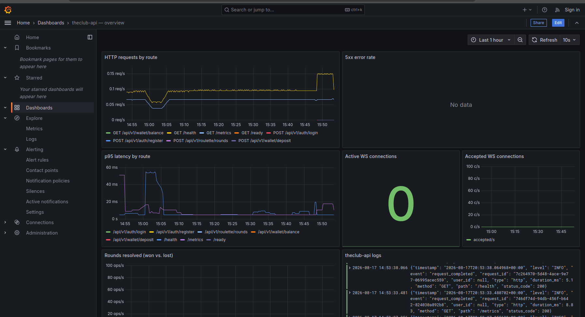
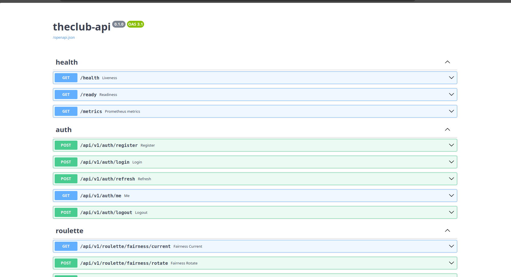
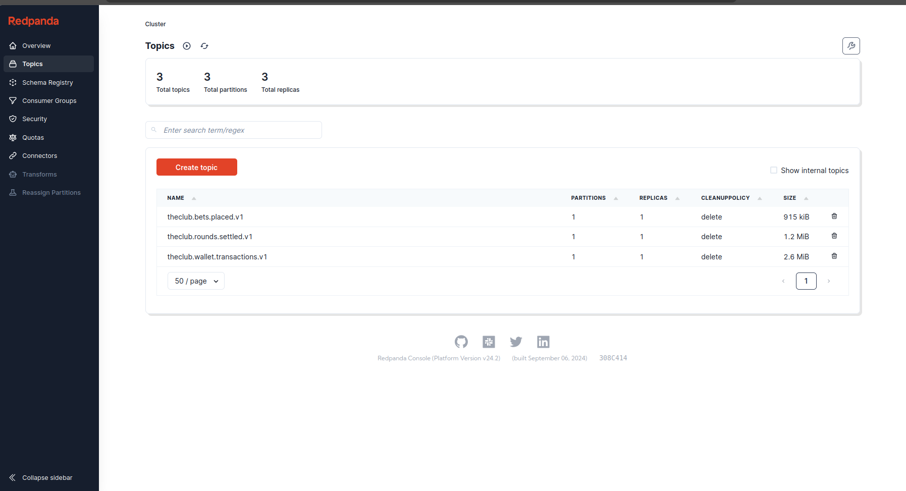
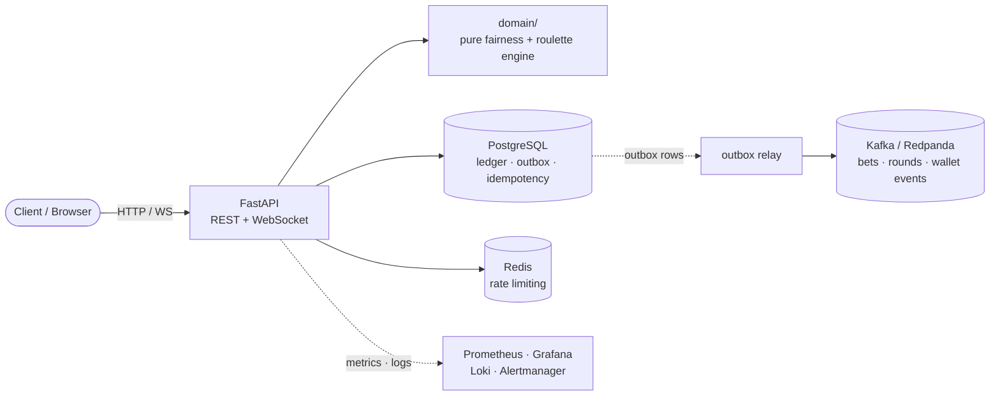
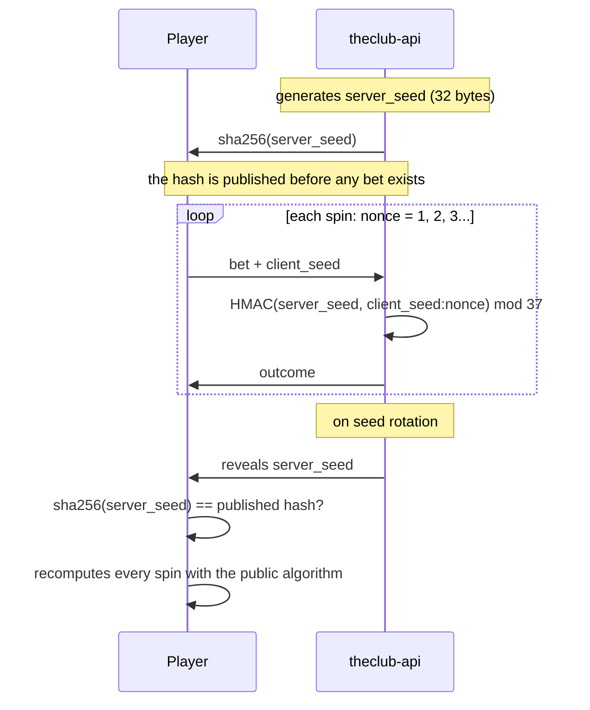

<h1 align="center">theclub-api</h1>
<p align="center"><b>Provably-fair roulette engine with real-time WebSocket updates, Kafka event streaming and a full observability stack.</b></p>

<p align="center">
  <a href="https://github.com/alexander-tinoco/theclub-api/actions/workflows/ci.yml"></a>
  
  
  
  
  <a href="LICENSE"></a>
</p>

This is the game engine behind The Club. It resolves European roulette rounds, moves money
with ledger-grade integrity and streams every event to Kafka. It's a portfolio project, but
built to production standards, not a CRUD demo with a roulette theme slapped on top.

- Provably fair: HMAC-SHA256 commit-reveal, verifiable by any player after the fact
- Money handled as integer minor units, ledger-backed, tested under real concurrency
- Outbox pattern, so a Kafka outage never loses or duplicates an event
- Real-time WebSocket updates for round results and balance changes
- JWT auth with refresh rotation, reuse detection and zero-downtime secret rotation
- Full observability stack (Prometheus, Grafana, Loki, Alertmanager), all provisioned as code
- 220 tests, 99% coverage, CI on every push

## Screenshots

<table>
  <tr>
    <td width="33%"><br><sub>Grafana, live metrics dashboard</sub></td>
    <td width="33%"><br><sub>Interactive API docs (Swagger UI)</sub></td>
    <td width="33%"><br><sub>Redpanda, Kafka event topics</sub></td>
  </tr>
</table>

## Architecture



`app/domain/` has no external dependencies at all. No FastAPI, no SQLAlchemy, no IO, just
pure math over money, fairness and the roulette table. That's what lets 1M simulated spins
run in about 4 seconds without touching Docker.

<details>
<summary><b>Provably fair, in one diagram</b></summary>


</details>

## Engineering highlights

A few patterns and decisions that are probably worth a closer look than the rest:

**Money never touches a float.** Every amount is a `BIGINT` in minor units. Debits are a
single `UPDATE wallets SET balance = balance - :stake WHERE balance >= :stake RETURNING
balance`, no read-then-write, no race window. There's a test that fires 10 truly concurrent
requests (`asyncio.gather`, not a loop) at the same idempotency key and checks the database
ends up debited exactly once.

**Outbox pattern instead of dual writes.** Every domain event gets inserted into an `outbox`
table in the same transaction as the business write. A background relay (`FOR UPDATE SKIP
LOCKED`, exponential backoff) publishes to Kafka afterward, so a broker outage just delays
events instead of losing or duplicating money.

**Idempotency is a first-class concern here, not an afterthought.** `Idempotency-Key` is
required on every state-changing endpoint, backed by a 3-transaction claim/execute/reconcile
mechanism built to handle genuinely concurrent duplicate requests, not just sequential
retries.

**Provably fair RNG.** HMAC-SHA256 commit-reveal with rejection sampling, never `hash % 37`,
which is measurably biased. Any player can recompute a spin once the server seed gets
revealed.

**JWT auth done properly.** Short-lived access tokens, opaque (non-JWT) refresh tokens with
rotation and reuse detection that revokes the whole token family on theft, and zero-downtime
secret rotation (`JWT_PREVIOUS_SECRETS`) so rotating the signing key doesn't log everyone out.

**Structured, correlated logging.** One canonical JSON line per request or connection
(`request_id`, `user_id`, status, duration, business fields) using `contextvars` and a custom
ASGI middleware. Not scattered `logger.info` calls, and not `BaseHTTPMiddleware`, which
quietly breaks WebSocket support and context propagation.

**Real integration tests, not mocks.** The suite runs against actual Postgres, Redis and
Kafka containers, including one test that kills the real Redpanda container mid-bet to check
the outbox survives a broker outage, and a Hypothesis property test that fuzzes the roulette
payout math.

**Observability as code.** Prometheus, Grafana (datasources and dashboard), Loki and
Alertmanager are all provisioned through committed config. Nothing was clicked together in a
UI.

## Quick start

Requires [uv](https://docs.astral.sh/uv/) and Docker.

```bash
uv sync                 # Python 3.14 + dependencies
cp .env.example .env    # optional, every value has a sane local default
make up                 # postgres + redpanda + redis + api + observability stack
curl localhost:8010/health
```

<details>
<summary>Full service list and ports</summary>

| Service | URL | Port variable |
|---|---|---|
| API | http://localhost:8010 | `API_PORT` |
| Interactive docs | http://localhost:8010/docs | not configurable |
| Redpanda console | http://localhost:8090 | `CONSOLE_PORT` |
| Postgres | `localhost:5432` (`theclub`/`theclub`) | `POSTGRES_PORT` |
| Kafka (from host) | `localhost:19092` | `KAFKA_PORT` |
| Redis | `localhost:6389` | `REDIS_PORT` |
| Grafana | http://localhost:3002 (anonymous access) | `GRAFANA_PORT` |
| Prometheus | http://localhost:9091 | `PROMETHEUS_PORT` |
| Loki | http://localhost:3100 | `LOKI_PORT` |
| Alertmanager | http://localhost:9093 | `ALERTMANAGER_PORT` |

Ports default off the beaten path (9091, 3002, 6389 and so on) so they don't clash with
other local projects. Override any of them in `.env`.
</details>

```bash
make dev    # local API with hot reload, no image rebuild
make test   # full suite. make test-unit for the ones that don't need services running
make check  # everything CI runs: lint, typecheck, contracts, db-check, coverage
```

## API

| Endpoint | What it does |
|---|---|
| `POST /api/v1/auth/register` / `/login` / `/refresh` / `/logout` | Account and token lifecycle, refresh rotation with reuse detection |
| `GET /api/v1/roulette/fairness/current` / `POST .../rotate` | Commit-reveal seed pair |
| `POST /api/v1/roulette/rounds` | Place one or more bets, resolved in the same request (`Idempotency-Key` required) |
| `GET /api/v1/wallet/balance` / `/transactions` / `POST /deposit` | Balance, ledger history, simulated deposit |
| `GET /api/v1/ws?token=` | WebSocket, pushes `round.settled` / `balance.updated` live |
| `GET /health` / `/ready` / `/metrics` | Liveness, readiness, Prometheus metrics |

Auth endpoints are rate-limited to 5 requests per minute per IP. Everything else defaults to
200/min. Full request and response schema lives in
[`contracts/openapi.json`](contracts/openapi.json), which is checked against the code in CI,
or just open `/docs` while the API is running.

## Tech stack

| Layer | Choices |
|---|---|
| API | FastAPI, Pydantic v2, WebSockets, `slowapi` (rate limiting) |
| Data | PostgreSQL, SQLAlchemy 2.0 (async), Alembic, Redis |
| Messaging | Kafka (Redpanda), `aiokafka` |
| Auth | PyJWT, `argon2-cffi` (Argon2id password hashing) |
| Observability | Prometheus, Grafana, Loki, Promtail, Alertmanager |
| Testing | pytest, pytest-asyncio, Hypothesis (property-based), httpx, coverage.py |
| Tooling | Docker, Docker Compose, GitHub Actions, uv, ruff, mypy (strict) |

## Status

All 10 phases of the original plan are done.

| | | | |
|---|---|---|---|
| 0 · Foundation | done | 6 · Kafka + outbox relay | done |
| 1 · Event contracts | done | 7 · WebSocket | done |
| 2 · Fairness + roulette domain | done | 8 · Hardening + observability | done |
| 3 · Persistence | done | 9 · CI | done |
| 4 · Auth | done | Redis rate limiting + secret rotation | done |
| 5 · Place-bet use case | done | Alertmanager | done |

## Docs

- [`plan/theclub-api-PLAN.md`](plan/theclub-api-PLAN.md): the full design, data model,
  fairness algorithm, event contract, and the reasoning behind each phase.
- [`contracts/`](contracts/): event JSON Schemas and the OpenAPI contract shared with
  `theclub-web`/`theclub-data`.
- [`CLAUDE.md`](CLAUDE.md): how this repo gets built with Claude Code, role-based workflow
  and commit conventions.
- [`LICENSE`](LICENSE): MIT.
